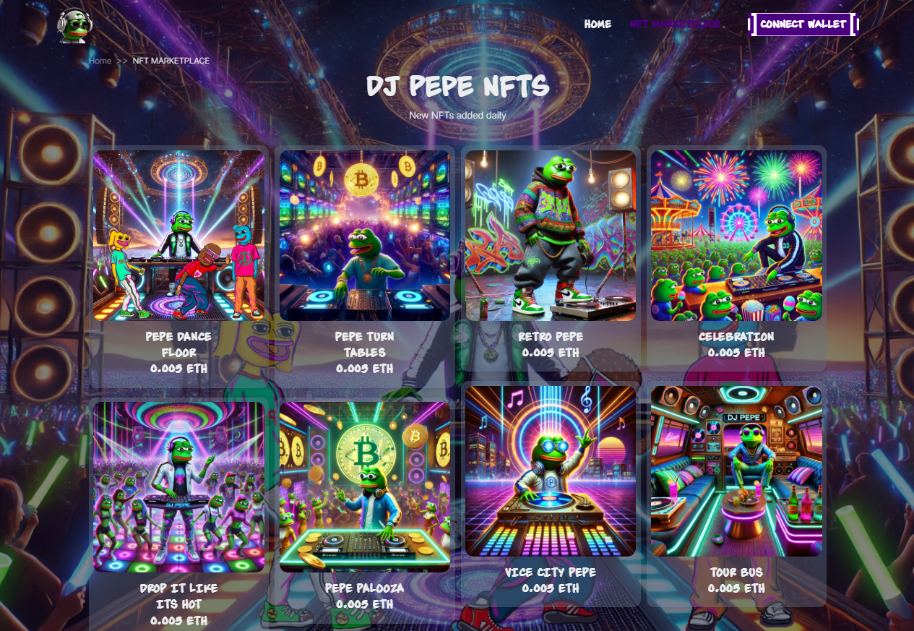

# DJ Pepe NFT Marketplace

DJ Pepe NFT Marketplace is a decentralized platform that enables users to create, buy, and sell NFTs, with a focus on generative art. Built using modern web technologies and blockchain integration, it offers a seamless experience for NFT enthusiasts.




🌐 Live Demo: [dj-pepe-nft-marketplace.vercel.app](https://dj-pepe-nft-marketplace.vercel.app/)

---

## 🛠️ Technologies Used

### Frontend

- Next.js 14
- Tailwind CSS
- NextUI v2
- TypeScript
- Framer Motion

### Backend

- Node.js
- Express.js
- PostgreSQL
- Subgraph

### Blockchain

- Solidity
- Hardhat
- IPFS for decentralized storage

---

## 🚀 Features

- **Generative Art Creation**: Leverages AI models like Stable Diffusion, DALL·E, and Midjourney to generate unique NFT assets.
- **NFT Minting**: Users can mint their generative art as NFTs directly from the platform.
- **Marketplace Functionality**: List, buy, and sell NFTs with integrated smart contract support.
- **User Dashboard**: Manage your NFT collections, track sales, and monitor activity.
- **Responsive Design**: Optimized for both desktop and mobile devices.

---

## 🧰 Getting Started

### Prerequisites

- Node.js (v16.14.0 or higher)
- npm, yarn, pnpm, or bun
- Metamask wallet extension

### Installation

1. **Clone the repository**:

   ```bash
   git clone https://github.com/KingCode0624/DjPepe-NFT-Markeplace.git
   cd DjPepe-NFT-Markeplace
   ```

2. **Install dependencies**:

   ```bash
   npm install
   # or
   yarn install
   ```

3. **Run the development server**:

   ```bash
   npm run dev
   # or
   yarn dev
   ```

4. **Access the application**:

   Open [http://localhost:3000](http://localhost:3000) in your browser.

---

## ⚙️ Configuration

### Environment Variables

Create a `.env.local` file in the root directory and add the following variables:

```env
NEXT_PUBLIC_API_URL=your_api_url
NEXT_PUBLIC_IPFS_GATEWAY=your_ipfs_gateway
# Add other necessary environment variables
```

### Tailwind CSS with pnpm

If you're using `pnpm`, add the following to your `.npmrc` file:

```ini
public-hoist-pattern[]=*@nextui-org/*
```

Then, reinstall dependencies:

```bash
pnpm install
```

---

## 📄 License

This project is licensed under the [MIT License](https://github.com/KingCode0624/DjPepe-NFT-Markeplace/blob/main/LICENSE).
